# Spring Boot Backend Development Guide
## Authentication, Authorization, and API Design

> [!IMPORTANT]
> This is a **LEARNING GUIDE** focused on structure, design, and professional practices.
> **NO CODE** is provided here — only concepts, flows, and architecture.

---

## 📚 Table of Contents

1. [Introduction to Spring Boot Layered Architecture](#1-introduction-to-spring-boot-layered-architecture)
2. [Task 1: Authentication & Authorization Structure](#2-task-1-authentication--authorization-structure)
3. [Task 2: REST API Design Based on Schema](#3-task-2-rest-api-design-based-on-schema)
4. [Next Steps](#4-next-steps)

---

## 1. Introduction to Spring Boot Layered Architecture

### 1.1 What is Layered Architecture?

In enterprise Spring Boot applications, we organize code into **separate layers**, each with a specific responsibility. This is called **Separation of Concerns**.

```
┌─────────────────────────────────────┐
│       CONTROLLER LAYER              │  ← Handles HTTP requests/responses
│   (REST endpoints, JSON handling)   │
└──────────────┬──────────────────────┘
               │
               ▼
┌─────────────────────────────────────┐
│         SERVICE LAYER               │  ← Contains ALL business rules
│   (Validation, rules, workflows)    │
└──────────────┬──────────────────────┘
               │
               ▼
┌─────────────────────────────────────┐
│      REPOSITORY LAYER               │  ← Data access only (CRUD)
│     (Database interactions)         │
└──────────────┬──────────────────────┘
               │
               ▼
┌─────────────────────────────────────┐
│          DATABASE                   │
└─────────────────────────────────────┘
```

### 1.2 Layer Responsibilities

| Layer | Responsibility | What It Does | What It DOESN'T Do |
|-------|---------------|--------------|-------------------|
| **Controller** | HTTP Interface | Receives HTTP requests, calls Service, returns HTTP responses | **NO business logic**, **NO database access** |
| **Service** | Business Logic | Validates data, enforces rules, orchestrates workflows | **NO knowledge of HTTP** (no `HttpServletRequest`) |
| **Repository** | Data Access | CRUD operations on database | **NO business decisions** |

> [!WARNING]
> **Common Mistake**: Controllers directly calling Repositories.
> **Rule**: Controllers must NEVER talk to Repositories. Always go through Service.

---

## 2. Task 1: Authentication & Authorization Structure

### 2.1 Core Concepts Explained (Beginner-Friendly)

Let's understand the key concepts before diving into the design:

#### 2.1.1 What is Authentication?

**Authentication** = **"Who are you?"**

- User proves their identity (usually username/email + password)
- System verifies credentials
- If valid, system confirms: "Yes, you are User X"

#### 2.1.2 What is Authorization?

**Authorization** = **"What can you do?"**

- After knowing who you are, system checks your **role** or **permissions**
- Example: `ROLE_ADMIN` can delete orders, `ROLE_CUSTOMER` cannot
- Authorization happens **after** authentication

#### 2.1.3 What is a Token?

A **token** is a **secret string** that proves you're authenticated, so you don't have to send username/password with every request.

**Think of it like a movie ticket:**
- You show ID and buy a ticket once (login)
- Then you use the ticket to enter (token)
- You don't show ID again for every movie scene

#### 2.1.4 Access Token vs Refresh Token

| | Access Token | Refresh Token |
|---|--------------|---------------|
| **Purpose** | Used for API calls | Used to get a new access token |
| **Lifespan** | Short (15 min - 1 hour) | Long (7 days - 30 days) |
| **Stored where?** | Frontend memory (not localStorage) | Database (secure) |
| **Security** | If stolen, expires soon | Stored in DB, can be revoked |

**Why both?**
- Short access token = Less risk if stolen
- Refresh token = User doesn't have to login every 15 minutes

#### 2.1.5 Role-Based Access Control (RBAC)

**RBAC** = Authorization based on **roles**.

Example:
- User has role `ROLE_ADMIN` → Can access `/admin/*` endpoints
- User has role `ROLE_CUSTOMER` → Can only access `/orders` for their own orders

---

### 2.2 Authentication Flow (Step-by-Step)

Let me walk you through **exactly what happens** when a user logs in and makes API calls.

#### 2.2.1 Registration Flow

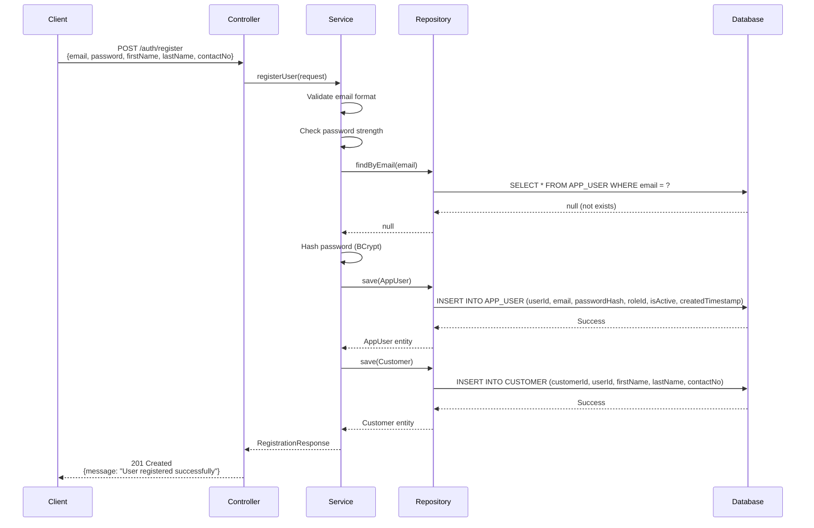

**Tables Used:**
- `APP_USER`: Stores authentication credentials
- `USER_ROLE`: Stores role definition (ADMIN, CUSTOMER, etc.)
- `CUSTOMER`: Stores business profile

**Key Points:**
1. Password is **never stored** in plain text. We hash it using **BCrypt** (Spring Security built-in)
2. Default role is `ROLE_CUSTOMER` (roleId = 2, for example)
3. `userId` is a **UUID** (globally unique identifier)
4. **Transaction**: Both `APP_USER` and `CUSTOMER` must be saved together (if one fails, both rollback)

---

#### 2.2.2 Login Flow

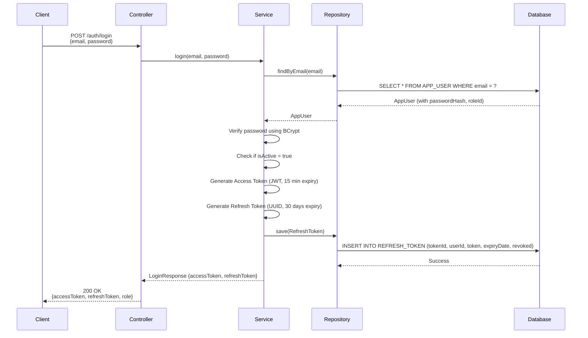

**Tables Used:**
- `APP_USER`: Verify credentials
- `REFRESH_TOKEN`: Store refresh token

**Key Points:**
1. Password verification uses BCrypt's `matches()` method
2. **Access Token** (JWT) contains: userId, email, role, expiry time
3. **Refresh Token** is stored in database so we can revoke it later
4. The client receives BOTH tokens

---

#### 2.2.3 Making an Authenticated API Call

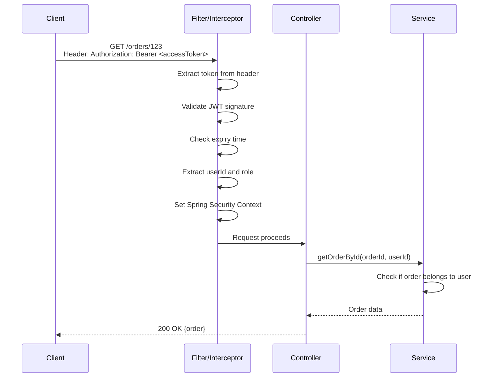

**No Database Tables Used Here** (token is verified by JWT signature, no DB call!)

**Key Points:**
1. **JWT is self-contained**: All info (userId, role, expiry) is in the token itself
2. A **Filter/Interceptor** runs **before** the Controller
3. If token is invalid/expired → Returns `401 Unauthorized` immediately
4. No database call needed for every request (efficient!)

---

#### 2.2.4 Refreshing the Access Token

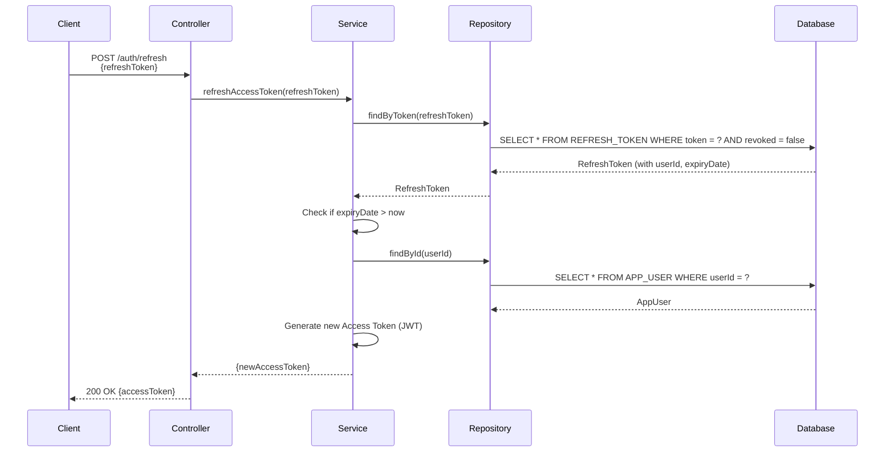

**Tables Used:**
- `REFRESH_TOKEN`: Validate refresh token
- `APP_USER`: Get latest user info

**Key Points:**
1. Refresh token must not be revoked (`revoked = false`)
2. Refresh token must not be expired
3. Generates a **new** access token (the refresh token stays the same)

---

#### 2.2.5 Logout Flow

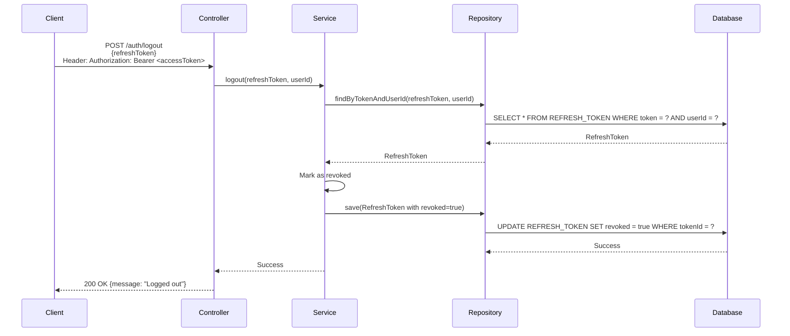

**Tables Used:**
- `REFRESH_TOKEN`: Revoke the token

**Key Points:**
1. We **don't delete** the token, we set `revoked = true` (audit trail)
2. The access token will expire on its own (can't be revoked in stateless JWT)
3. Client should delete both tokens from memory

---

### 2.3 Module Structure (Packages & Classes)

Now let's organize the code into proper **packages** and **classes**.

```
src/main/java/com/ordermgmt/
│
├── config/                    ← Configuration classes
│   ├── SecurityConfig.java    ← Spring Security setup
│   └── JwtConfig.java         ← JWT settings (secret, expiry)
│
├── security/                  ← Security utilities
│   ├── JwtTokenProvider.java  ← Generate & validate JWT
│   └── JwtAuthenticationFilter.java ← Intercept requests, validate token
│
├── controller/                ← REST endpoints (HTTP layer)
│   └── AuthController.java    ← /auth/register, /auth/login, /auth/logout, /auth/refresh
│
├── service/                   ← Business logic
│   └── AuthService.java       ← All authentication logic
│
├── repository/                ← Data access (JPA)
│   ├── AppUserRepository.java
│   ├── RefreshTokenRepository.java
│   └── CustomerRepository.java
│
├── entity/                    ← JPA entities (map to DB tables)
│   ├── AppUser.java           ← APP_USER table
│   ├── UserRole.java          ← USER_ROLE table
│   ├── RefreshToken.java      ← REFRESH_TOKEN table
│   └── Customer.java          ← CUSTOMER table
│
└── dto/                       ← Data Transfer Objects (request/response)
    ├── request/
    │   ├── RegisterRequest.java
    │   ├── LoginRequest.java
    │   └── RefreshTokenRequest.java
    └── response/
        ├── AuthResponse.java
        └── MessageResponse.java
```

---

### 2.4 Layer Responsibilities for Authentication

#### 2.4.1 Controller Layer (`AuthController`)

**Responsibility**: Handle HTTP requests and responses

**What it does:**
- Define REST endpoints: `POST /auth/register`, `POST /auth/login`, etc.
- Receive JSON from client
- Call `AuthService` methods
- Return JSON responses with correct HTTP status codes

**What it does NOT do:**
- Password hashing
- Token generation
- Database access
- Validation logic

**Example endpoints:**
```
POST   /auth/register    → registerUser()
POST   /auth/login       → login()
POST   /auth/logout      → logout()
POST   /auth/refresh     → refreshToken()
```

---

#### 2.4.2 Service Layer (`AuthService`)

**Responsibility**: ALL business logic for authentication

**What it does:**
- Validate input (email format, password strength)
- Hash passwords using BCrypt
- Generate JWT access tokens
- Generate refresh tokens
- Verify credentials
- Check if user is active
- Business rule: "Cannot register duplicate email"
- Business rule: "Refresh token must not be expired"

**What it does NOT do:**
- Know about HTTP requests/responses
- Directly access database (uses Repository)

**Methods:**
```
registerUser(request)        → Creates user + customer
login(email, password)       → Returns tokens
logout(refreshToken, userId) → Revokes token
refreshAccessToken(token)    → Generates new access token
```

---

#### 2.4.3 Repository Layer

**Responsibility**: Database CRUD operations only

**Repositories:**
1. `AppUserRepository` extends `JpaRepository<AppUser, String>`
   - `findByEmail(email)`
   - `save(appUser)`

2. `RefreshTokenRepository` extends `JpaRepository<RefreshToken, String>`
   - `findByToken(token)`
   - `findByUserId(userId)`
   - `save(refreshToken)`

3. `CustomerRepository` extends `JpaRepository<Customer, String>`
   - `save(customer)`
   - `findByUserId(userId)`

**What it does:**
- Simple queries: find by email, find by token, save, delete

**What it does NOT do:**
- Business logic
- Validation
- Token generation

---

### 2.5 Database Table Usage Mapping

| Operation | Controller | Service | Repository | Database Tables |
|-----------|-----------|---------|------------|-----------------|
| **Register** | `POST /auth/register` | `AuthService.registerUser()` | `AppUserRepository`, `CustomerRepository` | `APP_USER`, `USER_ROLE`, `CUSTOMER` |
| **Login** | `POST /auth/login` | `AuthService.login()` | `AppUserRepository`, `RefreshTokenRepository` | `APP_USER`, `REFRESH_TOKEN` |
| **Logout** | `POST /auth/logout` | `AuthService.logout()` | `RefreshTokenRepository` | `REFRESH_TOKEN` |
| **Refresh Token** | `POST /auth/refresh` | `AuthService.refreshAccessToken()` | `RefreshTokenRepository`, `AppUserRepository` | `REFRESH_TOKEN`, `APP_USER` |
| **Access Protected API** | Any protected endpoint | N/A (handled by filter) | N/A | None (JWT self-contained) |

---

### 2.6 Role-Based Authorization (RBAC)

#### 2.6.1 How Roles Work

The `USER_ROLE` table contains:
```
roleId | roleName
-------|-------------
1      | ROLE_ADMIN
2      | ROLE_CUSTOMER
```

> [!NOTE]
> Spring Security convention: Role names start with `ROLE_` prefix.

#### 2.6.2 Authorization Flow

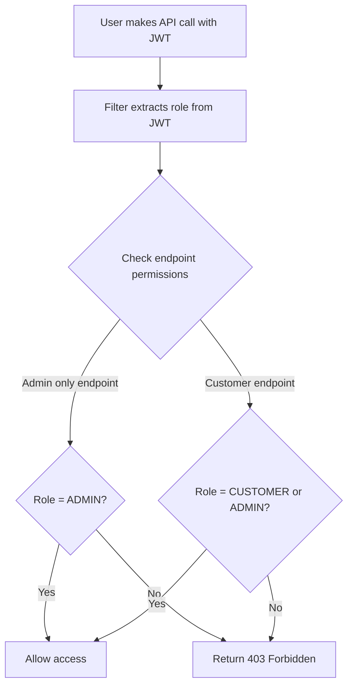

#### 2.6.3 Protecting Endpoints

In `SecurityConfig`, we define rules:

```
/auth/**                 → Permit all (login/register don't need auth)
/admin/**                → Only ROLE_ADMIN
/orders (POST)           → ROLE_CUSTOMER or ROLE_ADMIN
/orders/{id} (GET)       → ROLE_CUSTOMER (own orders) or ROLE_ADMIN (all orders)
/inventory/** (PUT)      → Only ROLE_ADMIN
/inventory/** (GET)      → ROLE_CUSTOMER or ROLE_ADMIN
```

> [!IMPORTANT]
> For `GET /orders/{id}`, we need **custom logic** in the Service:
> - If user is ADMIN → Show any order
> - If user is CUSTOMER → Only show their own orders

This is called **Resource-Level Authorization** (not just role-based).

---

### 2.7 Summary: Authentication & Authorization Structure

| Concept | Explanation |
|---------|-------------|
| **Authentication** | Login process that verifies identity (email + password) |
| **Authorization** | Permission checking based on role (ADMIN vs CUSTOMER) |
| **Access Token (JWT)** | Short-lived token (15 min) for API calls, self-contained |
| **Refresh Token** | Long-lived token (30 days) stored in DB, used to get new access token |
| **RBAC** | Role-Based Access Control using `USER_ROLE` and `APP_USER.roleId` |
| **Controller** | HTTP layer, no business logic |
| **Service** | ALL business logic (validation, hashing, token generation) |
| **Repository** | Data access only (simple CRUD) |
| **Key Tables** | `APP_USER`, `USER_ROLE`, `REFRESH_TOKEN`, `CUSTOMER` |

---

## 3. Task 2: REST API Design Based on Schema

### 3.1 API Design Principles

Before we design specific endpoints, let's understand the principles:

#### 3.1.1 RESTful Conventions

| HTTP Method | Purpose | Example | Success Code |
|-------------|---------|---------|--------------|
| `GET` | Retrieve resource | `GET /orders/123` | 200 OK |
| `POST` | Create new resource | `POST /orders` | 201 Created |
| `PUT` | Update existing resource | `PUT /orders/123/status` | 200 OK |
| `DELETE` | Delete resource | `DELETE /orders/123` | 204 No Content |

#### 3.1.2 Response Format (Always JSON)

**Success Response:**
```json
{
  "data": { ... },
  "message": "Success"
}
```

**Error Response:**
```json
{
  "error": "Resource not found",
  "message": "Order with ID 123 does not exist",
  "timestamp": "2026-02-05T11:20:00Z"
}
```

---

### 3.2 API Modules

Let's group APIs by business domain:

1. **Auth Module** (`/auth`) — Already covered in Task 1
2. **Order Module** (`/orders`) — Create, view, update orders
3. **Inventory Module** (`/inventory`) — View and manage stock
4. **Customer Module** (`/customers`) — Customer profile management

---

### 3.3 Mandatory APIs (Detailed Design)

#### 3.3.1 API: Create Order

##### **Endpoint**
```
POST /orders
```

##### **Purpose**
Allow a customer to place a new order.

##### **Authorization**
- `ROLE_CUSTOMER` (own orders)
- `ROLE_ADMIN` (can create on behalf of any customer)

##### **Request Headers**
```
Authorization: Bearer <accessToken>
Content-Type: application/json
```

##### **Request Body**
```json
{
  "items": [
    {
      "itemId": "ITEM-001",
      "quantity": 5
    },
    {
      "itemId": "ITEM-002",
      "quantity": 3
    }
  ]
}
```

##### **Validation Rules (Service Layer)**

1. **Customer exists**: Extract `userId` from JWT → Get `customerId` from `CUSTOMER` table
2. **Items exist**: Each `itemId` must exist in `INVENTORY_ITEM`
3. **Stock available**: `availableStock >= quantity` for each item
4. **Price exists**: Each item must have an active price in `PRICING_CATALOG` (latest `createdTimestamp`)
5. **No duplicate items**: Cannot have same `itemId` twice in one order

##### **Business Logic Flow (Service Layer)**

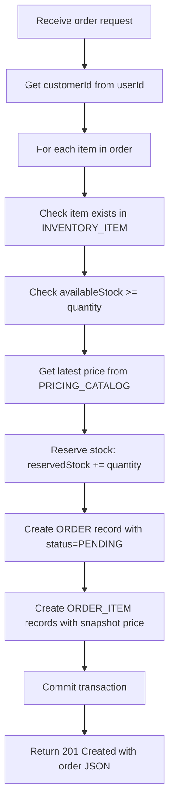

##### **Database Tables Used**

| Table | Operation |
|-------|-----------|
| `APP_USER` | Get userId from JWT (already in context) |
| `CUSTOMER` | Find `customerId` by `userId` |
| `INVENTORY_ITEM` | Check stock, reserve stock |
| `PRICING_CATALOG` | Get latest price (WHERE itemId = ? ORDER BY createdTimestamp DESC LIMIT 1) |
| `ORDER_STATUS_LOOKUP` | Get statusId for "PENDING" |
| `ORDERS` | INSERT new order |
| `ORDER_ITEM` | INSERT items with snapshot price |

##### **Success Response (201 Created)**
```json
{
  "orderId": "550e8400-e29b-41d4-a716-446655440000",
  "customerId": "customer-123",
  "status": "PENDING",
  "items": [
    {
      "itemId": "ITEM-001",
      "quantity": 5,
      "unitPrice": 99.99
    },
    {
      "itemId": "ITEM-002",
      "quantity": 3,
      "unitPrice": 149.50
    }
  ],
  "totalAmount": 948.45,
  "createdTimestamp": "2026-02-05T11:20:00Z"
}
```

##### **Error Responses**

| Status Code | Reason | Example |
|-------------|--------|---------|
| 400 Bad Request | Invalid input | "Quantity must be greater than 0" |
| 404 Not Found | Item doesn't exist | "Item ITEM-999 not found" |
| 409 Conflict | Insufficient stock | "Item ITEM-001 only has 3 units available, requested 5" |
| 401 Unauthorized | No/invalid token | "Access token expired" |

---

#### 3.3.2 API: Retrieve Order by ID

##### **Endpoint**
```
GET /orders/{orderId}
```

##### **Purpose**
Retrieve details of a specific order.

##### **Authorization**
- `ROLE_CUSTOMER`: Can only view their own orders
- `ROLE_ADMIN`: Can view any order

##### **Request Headers**
```
Authorization: Bearer <accessToken>
```

##### **Validation Rules (Service Layer)**

1. **Order exists**: Check `ORDERS` table
2. **Ownership check** (if CUSTOMER role):
   - Get `customerId` from order
   - Get `userId` from JWT
   - Verify `CUSTOMER.userId` matches JWT's userId
3. **Admin bypass**: If role is ADMIN, skip ownership check

##### **Business Logic Flow (Service Layer)**

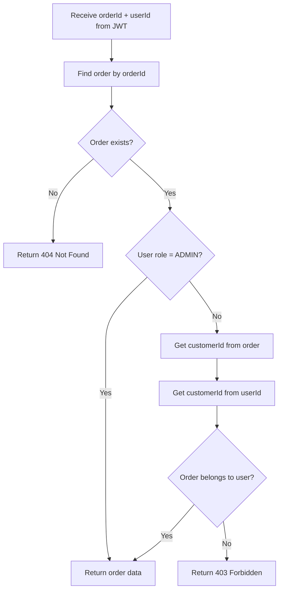

##### **Database Tables Used**

| Table | Operation |
|-------|-----------|
| `ORDERS` | SELECT by orderId |
| `ORDER_ITEM` | SELECT all items for the order (JOIN) |
| `CUSTOMER` | Verify ownership (userId → customerId) |
| `ORDER_STATUS_LOOKUP` | Get status name (JOIN) |

##### **Success Response (200 OK)**
```json
{
  "orderId": "550e8400-e29b-41d4-a716-446655440000",
  "customerId": "customer-123",
  "status": "CONFIRMED",
  "items": [
    {
      "itemId": "ITEM-001",
      "quantity": 5,
      "unitPrice": 99.99
    }
  ],
  "totalAmount": 499.95,
  "createdTimestamp": "2026-02-05T11:20:00Z",
  "updatedTimestamp": "2026-02-05T11:25:00Z"
}
```

##### **Error Responses**

| Status Code | Reason |
|-------------|--------|
| 404 Not Found | Order doesn't exist |
| 403 Forbidden | Customer trying to view another customer's order |
| 401 Unauthorized | No/invalid token |

---

#### 3.3.3 API: Update Order Status

##### **Endpoint**
```
PUT /orders/{orderId}/status
```

##### **Purpose**
Update the status of an order (e.g., PENDING → CONFIRMED → SHIPPED).

##### **Authorization**
- Only `ROLE_ADMIN` can update status

##### **Request Headers**
```
Authorization: Bearer <accessToken>
Content-Type: application/json
```

##### **Request Body**
```json
{
  "status": "CONFIRMED"
}
```

##### **Validation Rules (Service Layer)**

1. **Order exists**: Check `ORDERS` table
2. **Status exists**: Verify new status exists in `ORDER_STATUS_LOOKUP`
3. **State machine validation**: Ensure the transition is allowed

**Order Status State Machine:**

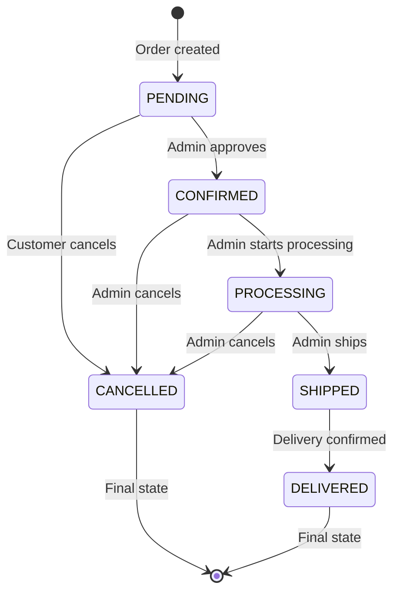

**Allowed Transitions:**

| From | To | Notes |
|------|-----|-------|
| PENDING | CONFIRMED | Admin approves order |
| PENDING | CANCELLED | Customer/Admin cancels |
| CONFIRMED | PROCESSING | Admin starts fulfillment |
| CONFIRMED | CANCELLED | Admin cancels before processing |
| PROCESSING | SHIPPED | Admin ships order |
| PROCESSING | CANCELLED | Admin cancels during processing |
| SHIPPED | DELIVERED | Delivery complete |

**Forbidden Transitions:**
- Cannot change status after CANCELLED
- Cannot change status after DELIVERED
- Cannot go from DELIVERED → SHIPPED (backward)
- Cannot skip steps (e.g., PENDING → SHIPPED)

##### **Business Logic Flow (Service Layer)**

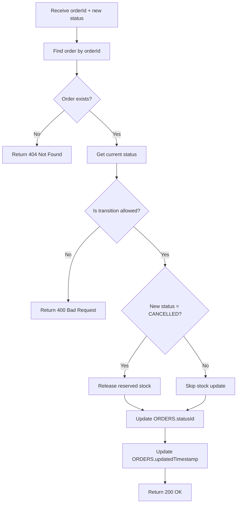

##### **Database Tables Used**

| Table | Operation |
|-------|-----------|
| `ORDERS` | SELECT by orderId, UPDATE statusId |
| `ORDER_STATUS_LOOKUP` | Verify new status exists |
| `ORDER_ITEM` | Get itemId and quantity (for stock release) |
| `INVENTORY_ITEM` | UPDATE reservedStock (if cancelling) |

##### **Stock Management:**

**When order is CANCELLED:**
- For each item in `ORDER_ITEM`:
  - `INVENTORY_ITEM.reservedStock -= quantity`
  - `INVENTORY_ITEM.availableStock` stays the same (was never reduced)

**When order is DELIVERED:**
- For each item:
  - `INVENTORY_ITEM.availableStock -= quantity`
  - `INVENTORY_ITEM.reservedStock -= quantity`

##### **Success Response (200 OK)**
```json
{
  "orderId": "550e8400-e29b-41d4-a716-446655440000",
  "status": "CONFIRMED",
  "updatedTimestamp": "2026-02-05T11:30:00Z",
  "message": "Order status updated successfully"
}
```

##### **Error Responses**

| Status Code | Reason | Example |
|-------------|--------|---------|
| 400 Bad Request | Invalid transition | "Cannot change status from DELIVERED to SHIPPED" |
| 404 Not Found | Order doesn't exist | "Order 123 not found" |
| 403 Forbidden | Not admin | "Only admins can update order status" |
| 401 Unauthorized | No/invalid token | "Access token expired" |

---

#### 3.3.4 API: Retrieve Inventory Item

##### **Endpoint**
```
GET /inventory/{itemId}
```

##### **Purpose**
Get current stock information for an inventory item.

##### **Authorization**
- `ROLE_CUSTOMER`: Can view (for browsing products)
- `ROLE_ADMIN`: Can view

##### **Request Headers**
```
Authorization: Bearer <accessToken>
```

##### **Validation Rules (Service Layer)**

1. **Item exists**: Check `INVENTORY_ITEM` table

##### **Business Logic Flow (Service Layer)**

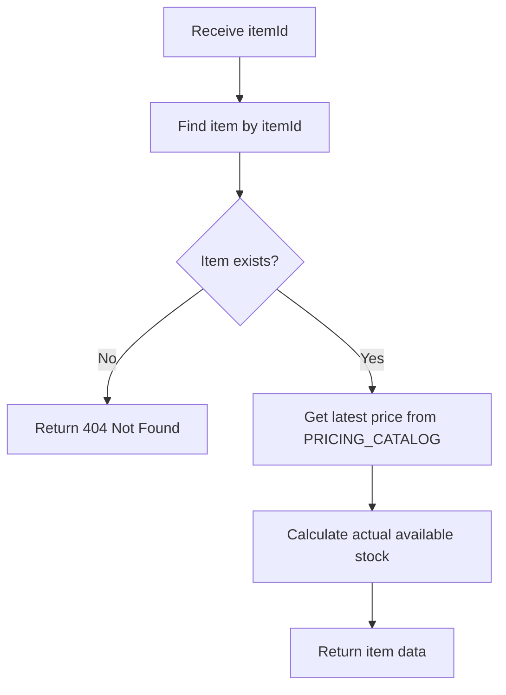

##### **Database Tables Used**

| Table | Operation |
|-------|-----------|
| `INVENTORY_ITEM` | SELECT by itemId |
| `PRICING_CATALOG` | Get latest price (ORDER BY createdTimestamp DESC LIMIT 1) |

##### **Success Response (200 OK)**
```json
{
  "itemId": "ITEM-001",
  "availableStock": 100,
  "reservedStock": 15,
  "actualAvailable": 85,
  "currentPrice": 99.99,
  "priceUpdatedAt": "2026-02-01T10:00:00Z"
}
```

**Note:** `actualAvailable = availableStock - reservedStock`

##### **Error Responses**

| Status Code | Reason |
|-------------|--------|
| 404 Not Found | Item doesn't exist |
| 401 Unauthorized | No/invalid token |

---

### 3.4 Additional APIs (Recommended)

Here are other important APIs based on the schema:

#### 3.4.1 Customer Module

| Endpoint | Method | Purpose | Auth |
|----------|--------|---------|------|
| `/customers/me` | GET | Get own profile | CUSTOMER, ADMIN |
| `/customers/me` | PUT | Update own profile | CUSTOMER, ADMIN |

**Tables:** `CUSTOMER`, `APP_USER`

---

#### 3.4.2 Order Module (Extended)

| Endpoint | Method | Purpose | Auth |
|----------|--------|---------|------|
| `/orders` | GET | List all orders (filtered by user if CUSTOMER) | CUSTOMER, ADMIN |
| `/orders/{orderId}` | DELETE | Cancel order (soft delete via status) | CUSTOMER (own), ADMIN |

**Tables:** `ORDERS`, `ORDER_ITEM`, `CUSTOMER`

---

#### 3.4.3 Inventory Module (Extended)

| Endpoint | Method | Purpose | Auth |
|----------|--------|---------|------|
| `/inventory` | GET | List all items | CUSTOMER, ADMIN |
| `/inventory/{itemId}` | PUT | Update stock (ADMIN only) | ADMIN |
| `/inventory/{itemId}/price` | POST | Add new price record | ADMIN |

**Tables:** `INVENTORY_ITEM`, `PRICING_CATALOG`

---

### 3.5 API Contract Summary

| API | Request | Response | Key Validation |
|-----|---------|----------|----------------|
| `POST /orders` | `{items:[{itemId, quantity}]}` | `201 Created {orderId, items, total}` | Stock availability, price exists |
| `GET /orders/{id}` | Path param: orderId | `200 OK {order details}` | Order exists, ownership check |
| `PUT /orders/{id}/status` | `{status}` | `200 OK {order, message}` | Valid state transition, admin only |
| `GET /inventory/{id}` | Path param: itemId | `200 OK {stock, price}` | Item exists |

---

### 3.6 How Business Rules Are Enforced

All business rules from [businessIntigrityCheck.txt](file:///home/anand.chaniyara/Documents/FinTech-JAVA/task1/ordermgmt/doc/businessIntigrityCheck.txt) are enforced in the **Service Layer**.

| Business Rule | Enforcement Location | How |
|---------------|---------------------|-----|
| "Order status must follow state machine" | `OrderService.updateStatus()` | Check allowed transitions in a map/enum |
| "No status change after CANCELLED/DELIVERED" | `OrderService.updateStatus()` | If current status is terminal, throw exception |
| "Inventory reservation must be atomic" | `OrderService.createOrder()` | Use `@Transactional` annotation |
| "Reserved stock released on cancellation" | `OrderService.updateStatus()` | If new status = CANCELLED, update `INVENTORY_ITEM` |
| "No duplicate itemId in same order" | `OrderService.createOrder()` | Validate request before saving |
| "Only latest price is active" | `PricingService.getActivePrice()` | `SELECT ... ORDER BY createdTimestamp DESC LIMIT 1` |
| "Customer must exist before order" | `OrderService.createOrder()` | Check `Customer` exists (FK will fail anyway) |

> [!TIP]
> Use `@Transactional` on Service methods. If any step fails, the entire operation rolls back (database stays consistent).

---

## 4. Next Steps

### 4.1 What You've Learned

✅ Layered architecture: Controller → Service → Repository → Database
✅ Authentication vs Authorization
✅ Access token (JWT) vs Refresh token
✅ Role-based access control (RBAC)
✅ Complete authentication flows (register, login, logout, refresh)
✅ Module structure (packages and classes)
✅ RESTful API design principles
✅ 4 mandatory APIs with full business logic
✅ How to enforce business rules in the Service layer
✅ Database table usage for each operation

---

### 4.2 When You're Ready for Code

Once you've understood the structure, we can proceed to:

1. **Create Entity classes** (JPA annotations)
2. **Create Repository interfaces** (Spring Data JPA)
3. **Create DTO classes** (request/response)
4. **Implement Service classes** (business logic)
5. **Implement Controllers** (REST endpoints)
6. **Configure Spring Security** (JWT, filters)
7. **Write tests** (unit + integration)

> [!IMPORTANT]
> **DON'T SKIP THE PLANNING PHASE**. Understanding structure first makes coding much easier.

---

### 4.3 Questions to Ask Yourself

Before writing code, ensure you can answer:

1. What is the difference between Controller and Service?
2. Why do we use both access token and refresh token?
3. What happens if a customer tries to view another customer's order?
4. Which database table stores roles?
5. What happens to reserved stock when an order is cancelled?
6. Can we go from PENDING status directly to SHIPPED? Why not?
7. Where is the password hashed? (Controller, Service, or Repository?)
8. Is the JWT stored in the database? Why or why not?

---

### 4.4 Your Learning Path

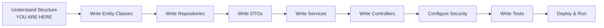

---

## Final Thoughts

You now have a **professional, enterprise-grade design** for:
- Authentication & Authorization system
- REST API structure

This is exactly how real-world Spring Boot applications are built in the industry.

**Next time we meet, you can ask:**
- "Show me the Entity classes for authentication"
- "Write the AuthService with business logic"
- "How do I configure Spring Security for JWT?"

But **first**, make sure you understand this document completely. Re-read the flows, trace them step-by-step, and visualize how data moves through the layers.

---

> [!TIP]
> **For Interview Preparation**: You can now explain authentication flows, layered architecture, RBAC, and API design like a senior engineer, even without seeing the code!

**Good luck with your learning journey! 🚀**
